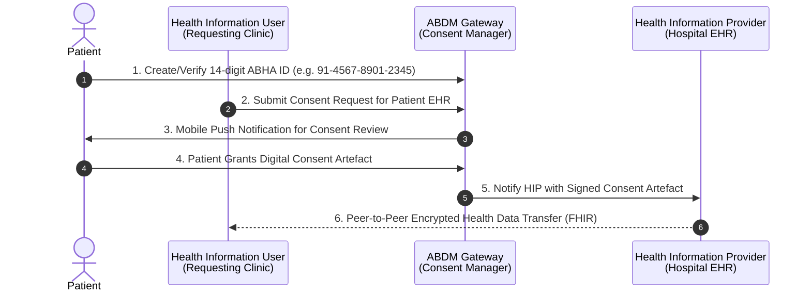

# MedIndia EHR — Mini Electronic Health Record & ABDM Platform

[](https://reactjs.org/)
[](https://www.typescriptlang.org/)
[](https://tailwindcss.com/)
[](https://nodejs.org/)
[](https://www.mongodb.com/)
[](https://abdm.gov.in/)

> **Developed by**: Gurupriyan K — Full-Stack Developer & AI/ML Engineer

A modern, production-grade **Mini Electronic Health Record (EHR)** and **Ayushman Bharat Digital Mission (ABDM)** prototype built with React, TypeScript, Node.js, Express, and MongoDB.

---

## ⚡ Quick Start (2 Commands — No Database Required)

> **MongoDB is optional.** The app works fully out of the box with pre-loaded patient data. No setup needed.

```bash
# Step 1 — Clone the repository
git clone https://github.com/Gurupriyan26/medindia-EHR-sample.git
cd medindia-EHR-sample

# Step 2 — Install all dependencies (root + client + server — automatic)
npm install

# Step 3 — Start the app (frontend + backend together)
npm run dev
```

**Open your browser at: http://localhost:5173**

That's it. No `.env` setup, no database, no extra terminals.

| Service | URL |
|---------|-----|
| Frontend (React) | http://localhost:5173 |
| Backend API | http://localhost:5000/api/health |

> The app comes pre-loaded with **7 realistic Indian patient records** including full EHR history, lab reports, ABDM consents, and appointments.

---

## 📑 Table of Contents
1. [Project Purpose & Clinical Overview](#1-project-purpose--clinical-overview)
2. [Key Core Features](#2-key-core-features)
3. [System Architecture](#3-system-architecture)
4. [Technology Stack & Design Choices](#4-technology-stack--design-choices)
5. [EHR Concepts Explained](#5-ehr-concepts-explained)
6. [ABHA & ABDM Ecosystem Explained](#6-abha--abdm-ecosystem-explained)
7. [AI / LLM Clinical Summarization Feature](#7-ai--llm-clinical-summarization-feature)
8. [Security & Privacy Architecture](#8-security--privacy-architecture)
9. [Database Models & Schemas](#9-database-models--schemas)
10. [REST API Endpoints Specification](#10-rest-api-endpoints-specification)
11. [How to Run the Application](#11-how-to-run-the-application)
12. [Limitations & Trade-offs](#12-limitations--trade-offs)
13. [Future Enhancements & Scalability Roadmap](#13-future-enhancements--scalability-roadmap)

---

## 1. Project Purpose & Clinical Overview

The **MedIndia EHR** platform bridges modern frontend design with clinical engineering. Unlike basic student CRUD applications, this project is architected as an authentic healthcare operating dashboard featuring:

- **Longitudinal Patient Health Records**: Integrated timeline linking consultations, multi-item prescriptions, and diagnostic lab reports with abnormal value highlighting.
- **Doctor Consultation Workstation**: Clinical assessment suite equipped with vitals tracking (auto-calculating BMI), ICD-10 diagnostic suggestions, and structured electronic prescription (e-Rx) authoring.
- **Ayushman Bharat Digital Mission (ABDM) Prototype**: Visual and functional simulator demonstrating India's national federated health infrastructure (ABHA generation, Care Context linking, and electronic Consent Artefacts).
- **AI-Powered Clinical Patient Summaries**: Instant clinical briefing synthesis for attending physicians, equipped with strict medical safety disclaimers and allergy contraindication checks.
- **Dual-Mode Resilient Architecture**: Auto-negotiates between an Express + MongoDB REST API backend and an offline zero-config client storage engine, guaranteeing 100% demo uptime in any interview environment.

---

## 2. Key Core Features

### 🏥 1. Operational Dashboard
- **Real-Time Clinical Metrics**: Total Registered Patients, Today's Consultations, Attention Lab Reports (abnormal/pending), and Active ABDM Consents.
- **Live Outpatient Token Queue**: Real-time consultation queue with status transitions (*Scheduled*, *In Consultation*, *Waiting*, *Completed*).
- **Recent Patients Quick Access**: Instant search and 1-click EHR navigation.
- **System Health & Gateway Status**: Visual monitoring of backend API connectivity and ABDM Gateway status.

### 👥 2. Comprehensive Patient Registry & Profile
- **Demographics & Search**: Search across patient names, 14-digit ABHA numbers (`91-XXXX-XXXX-XXXX`), and phone numbers with multi-criteria filters (Gender, Blood Group, Allergy presence).
- **Patient Registration & Edit Modal**: Validated forms including emergency contacts, chronic comorbidity logging, and allergy severity classification (*Mild*, *Moderate*, *Severe*, *Life-Threatening*).
- **Simulated ABDM Digital Health Card**: Visual identity card featuring QR code mock and verified ABHA address (`name@abdm`).

### 📋 3. Longitudinal EHR Profile & Timeline
- **Longitudinal Event Timeline**: Interactive chronological event stream organizing consultations, prescribed medications, diagnostic investigations, and consent grants.
- **Critical Allergy Alert Banner**: High-visibility safety warnings highlighting potential severe drug reactions (e.g. Penicillin, NSAIDs, Sulfa drugs).
- **Chronic Comorbidity Records**: Diagnosis year and management status (*Active*, *Controlled*, *In Remission*).
- **Active Prescriptions Directory**: Detailed drug name, strength, frequency (`1-0-1`), food timing (*Before/After Food*), and duration.

### 🩺 4. Doctor Module & Consultation Room
- **Patient Contextual Switcher**: Seamlessly switch between patients or launch directly from the appointment queue.
- **Vitals Logger**: Records Blood Pressure (`120/80 mmHg`), Pulse (`72 bpm`), Temperature (`98.6 °F`), SpO2 (`99%`), Weight (`70 kg`), Height (`170 cm`), and automatic BMI computation.
- **Diagnosis & ICD-10 Coding**: Autocomplete shortcuts for standard international diagnostic codes (e.g. `E11 - Type 2 Diabetes`, `I10 - Hypertension`, `I25 - CAD`).
- **Electronic Prescription (e-Rx) Composer**: Multi-drug prescription builder with dosage instructions and allergy contraindication awareness.
- **Lab Order Generation & Follow-Up Scheduling**: Directly order diagnostic investigations and schedule follow-up dates.

### 🔐 5. Patient Consent Management Hub
- **ABDM-Compliant Consent Artefacts**: Patient-controlled authorization table displaying Health Information Users (HIUs), clinical purpose, authorized health categories, and validity windows.
- **Grant & Revoke Controls**: Real-time consent modification with timestamped audit trail.
- **Cryptographic Artefact Inspector**: Modal rendering the simulated ECDSA-SHA256 digital signature and JSON schema matching National Health Authority (NHA) specifications.

### 🌐 6. Interactive ABDM / ABHA Sandbox
- **5-Stage Interactive Visualizer**:
  1. *Patient ABHA Identity Generation* (Aadhaar OTP simulation).
  2. *Health Facility Registry (HFR) & HIP Care Context Linking*.
  3. *Health Information User (HIU) Data Request*.
  4. *Consent Manager (CM) Gateway Authorization*.
  5. *Encrypted Health Information Exchange (HIE) via FHIR Bundles*.
- **Live Transaction Payload Console**: Inspect exact JSON requests and responses passing through the simulated gateway.

### 🧪 7. Diagnostic Laboratory Reports Manager
- **Investigation Categorization**: Biochemistry, Hematology, Radiology, Pathology, Microbiology, and Cardiology.
- **Multi-Parameter Builder**: Parameter name, observed value, unit, reference range, and abnormal flag toggles.
- **Clinical Interpretation & Doctor Remarks**: Detailed diagnostic summaries and severity classifications.

### 🎭 8. Role Perspective Switcher
- **Doctor View (`Dr. Sarah Rao`)**: Full access to clinical workstation, consult logs, prescription composer, and AI summaries.
- **Patient View (`Aarav Sharma`)**: Patient-centric privacy portal to review personal records and manage ABDM consent permissions.

---

## 3. System Architecture

```mermaid
graph TB
    subgraph Client ["Client Tier (React 18 + Vite + TypeScript + Tailwind CSS)"]
        UI["Healthcare UI Components"]
        AppContext["App Context & Role State"]
        APIClient["Dual-Mode API Service Layer"]
        LocalStore[("LocalStorage / In-Memory Mock Store")]
    end

    subgraph Server ["Backend Tier (Node.js + Express + TypeScript)"]
        Router["Express REST API Router (/api/*)"]
        Controllers["Entity Controllers (Patients, Visits, Labs, Consents, Appointments)"]
        AIService["AI Clinical Summary Engine"]
        MongooseODM["Mongoose ODM Models"]
    end

    subgraph External ["External Services & Database"]
        MongoDB[("MongoDB Database")]
        OpenAI["OpenAI API (Optional)"]
        NLP["Built-in Clinical NLP Engine"]
    end

    UI --> AppContext
    AppContext --> APIClient
    APIClient -->|REST API (Online)| Router
    APIClient -.->|Offline Fallback| LocalStore
    Router --> Controllers
    Controllers --> MongooseODM
    Controllers --> AIService
    AIService -->|If Key Provided| OpenAI
    AIService -->|Default Zero-Config| NLP
    MongooseODM --> MongoDB
```

---

## 4. Technology Stack & Design Choices

| Layer | Technology | Rationale & Trade-offs |
| :--- | :--- | :--- |
| **Frontend Core** | React 18 + Vite | Lightning-fast HMR, component modularity, high performance rendering. |
| **Language** | TypeScript 5 | Strict compile-time type safety across complex clinical records and API payloads. |
| **Styling** | Tailwind CSS 3 | Bespoke clinical design system with tailored healthcare palettes (Navy slate, clinical blue, emerald, amber, rose). |
| **Icons** | Lucide React | Crisp, accessible, and lightweight clinical iconography. |
| **Backend** | Node.js + Express | Lightweight, modular REST architecture with asynchronous non-blocking I/O. |
| **Database** | MongoDB + Mongoose | Schema flexibility ideal for polymorphic medical records, variable lab test parameters, and nested prescription objects. |
| **AI Summarizer** | Dual Clinical Engine | Combines an intelligent rule-based Medical NLP engine with optional OpenAI integration. |

---

## 5. EHR Concepts Explained

An **Electronic Health Record (EHR)** is a longitudinal digital record of patient health information generated by one or more clinical encounters in healthcare delivery settings:

```
┌────────────────────────────────────────────────────────┐
│               LONGITUDINAL PATIENT EHR                 │
├──────────────┬──────────────┬──────────────┬───────────┤
│ Demographics │  Encounters  │ Prescriptions│ Diagnostics
│  & ABHA ID   │  & Diagnoses │ (Active e-Rx)│  & Labs   │
├──────────────┼──────────────┼──────────────┼───────────┤
│ Blood Group, │ Chief Com-   │ Medicine,    │ Param,    │
│ Age, Gender, │ plaint, ICD, │ Dosage, Freq,│ Observed, │
│ Allergies    │ Vitals, Exam │ Timing, Dur. │ Ref Range │
└──────────────┴──────────────┴──────────────┴───────────┘
```

1. **Longitudinal Record vs. EMR**: While an EMR (Electronic Medical Record) contains only the standard medical and clinical data from one provider's office, an **EHR** is designed to share information across different healthcare providers and organizations.
2. **Care Contexts**: Groupings of clinical encounters (e.g., *Inpatient Admission*, *Cardiology OPD Visit*, *Diabetic Routine Checkup*) attached to a single identity.
3. **Problem List & Comorbidities**: Persistent tracking of active chronic conditions vs. resolved or remitted ailments.

---

## 6. ABHA & ABDM Ecosystem Explained

The **Ayushman Bharat Digital Mission (ABDM)** is the Government of India's national initiative to establish the digital backbone for integrated digital health infrastructure.



### ABDM Key Terminology:
- **ABHA (Ayushman Bharat Health Account)**: A 14-digit unique health identifier (e.g., `91-4567-8901-2345`) linked to an ABHA address (`user@abdm`).
- **HIP (Health Information Provider)**: Hospitals, diagnostic centers, and clinics that generate and hold patient records.
- **HIU (Health Information User)**: Medical practitioners or facilities requesting prior medical history to provide continued care.
- **Consent Manager (CM)**: The gateway facilitating patient consent lifecycle (Request → Grant → Revoke → Expire).
- **Consent Artefact**: A tamper-evident, digitally signed JSON document specifying purpose, data types, and access duration.

---

## 7. AI / LLM Clinical Summarization Feature

The **"Generate AI Patient Summary"** feature synthesizes complex longitudinal health records into a concise, structured clinical briefing intended to accelerate a doctor's pre-consultation chart review.

### Safety & Clinical Guardrails
> [!IMPORTANT]
> **Prominent Safety Disclaimer**: Every generated summary carries the mandatory notice:
> *"AI-generated clinical summary for healthcare professional reference only. Not a medical diagnosis or treatment directive."*
> The engine is strictly constrained from diagnosing new diseases or prescribing therapeutic interventions.

### Output Structure:
1. **Executive Clinical Synopsis**: 2-sentence overview of the patient's age, gender, active conditions, and recent consultation status.
2. **Active Conditions & Risk Assessment**: Comorbidity tracking with diagnosis dates and status.
3. **Key Allergies Warning**: High-priority alert highlighting drug allergies (e.g. Penicillin anaphylaxis, Aspirin bronchospasm).
4. **Current Medication Regimen**: Comprehensive list of ongoing prescriptions, dosages, and schedules.
5. **Diagnostic Lab Highlights**: Flagged abnormal results (e.g., elevated HbA1c, microalbuminuria, abnormal lipid panels).
6. **Suggested Clinical Focus for Today's Visit**: Practical checklist of vital re-checks and medication adherence verifications.

---

## 8. Security & Privacy Architecture

- **Zero Client Key Exposure**: API credentials and secrets are managed exclusively through backend environment variables (`.env`).
- **Role-Based Access Simulation**: Partitioning of administrative, physician, and patient interfaces.
- **Granular Consent Controls**: Data access requires valid, unrevoked consent artefacts with strict time boundaries.
- **Input Sanitization & Validation**: Server-side Mongoose schema validators and client-side form validations.
- **Safe Demo Data**: All sample records utilize 100% fictional Indian patient names, addresses, and contacts.

---

## 9. Database Models & Schemas

The database structure contains 5 core MongoDB collections:

```
medindia_ehr
├── patients       (Demographics, ABHA, allergies, medical history)
├── visits         (Consultation encounters, vitals, diagnosis, notes, prescriptions)
├── labreports     (Diagnostic tests, category, parameters, abnormal flags, results)
├── consents       (ABDM consent artefacts, requester, data types, validity, status)
└── appointments   (Token queue, patient details, time slots, statuses)
```

---

## 10. REST API Endpoints Specification

### Patients (`/api/patients`)
- `GET /api/patients` — List all patients (supports query filters: `search`, `gender`, `bloodGroup`).
- `GET /api/patients/:id` — Retrieve patient details by MongoDB ID or ABHA ID.
- `POST /api/patients` — Register new patient and generate ABHA care context.
- `PUT /api/patients/:id` — Update patient demographics and medical history.
- `DELETE /api/patients/:id` — Remove patient record.

### Visits & Consultations (`/api/visits`)
- `GET /api/visits?patientId=:id` — Fetch consultation encounters for a patient.
- `POST /api/visits` — Record new clinical visit, vitals, ICD diagnosis, and electronic prescriptions.

### Diagnostic Lab Reports (`/api/labs`)
- `GET /api/labs?patientId=:id` — Retrieve diagnostic lab reports.
- `POST /api/labs` — Create a new multi-parameter laboratory report.

### Consent Artefacts (`/api/consents`)
- `GET /api/consents?patientId=:id` — Get consent records.
- `POST /api/consents` — Create new ABDM consent artefact.
- `PATCH /api/consents/:id/status` — Update consent status (`GRANTED` / `REVOKED`).

### Appointments Queue (`/api/appointments`)
- `GET /api/appointments` — List appointment queue tokens.
- `POST /api/appointments` — Book new appointment.
- `PATCH /api/appointments/:id/status` — Update token status (`Waiting`, `In-Progress`, `Completed`).

### AI Patient Summaries (`/api/ai`)
- `GET /api/ai/patient-summary/:patientId` — Synthesize longitudinal EHR into clinical briefing.

---

## 11. How to Run the Project

### Prerequisites
- **Node.js v18+** — Download from https://nodejs.org
- **npm v9+** — Comes with Node.js
- **MongoDB** — *Completely optional.* App runs fully without it.

---

### Option A: Standard Setup (Recommended)

```bash
# Clone
git clone https://github.com/Gurupriyan26/medindia-EHR-sample.git
cd medindia-EHR-sample

# Install everything (client + server installs automatically via postinstall)
npm install

# Run both frontend and backend together
npm run dev
```

- Frontend: **http://localhost:5173**
- API: **http://localhost:5000/api/health**

---

### Option B: With MongoDB (Full Persistent Storage)

```bash
# 1. Install and start MongoDB Community from https://mongodb.com

# 2. Clone and install
git clone https://github.com/Gurupriyan26/medindia-EHR-sample.git
cd medindia-EHR-sample
npm install

# 3. Seed the database with sample patient data
npm run seed

# 4. Start the full stack
npm run dev
```

---

### Available Scripts

| Command | What it does |
|---------|-------------|
| `npm install` | Installs root + client + server dependencies |
| `npm run dev` | Starts both frontend (5173) and backend (5000) |
| `npm run client` | Start only the React frontend |
| `npm run server` | Start only the Express backend |
| `npm run seed` | Seed MongoDB with sample data |
| `npm run build` | Build both for production |

---

## 12. Limitations & Trade-offs

1. **Prototype ABDM Integration**: Operates within an educational sandbox model; does not integrate live Government of India NHA production OAuth2 certificates.
2. **Simulated Encryption**: Demonstrates Diffie-Hellman encryption schema concepts without requiring hardware security modules (HSMs).
3. **In-Memory / Storage Fallback**: Engineered for resilience during evaluation, persisting changes to browser localStorage when backend is unreachable.

---

## 13. Future Enhancements & Scalability Roadmap

- [ ] **FHIR R4 Bundle Validator**: Real-time validation against HL7 FHIR Indian Core Profiles (NRCES).
- [ ] **DICOM Medical Imaging Viewer**: In-browser radiology viewer for CT/MRI scans.
- [ ] **Voice-to-EHR Clinical Dictation**: Speech-to-text consultation transcriber for physicians.
- [ ] **Multi-Language Regional Localization**: Hindi, Tamil, Telugu, and Kannada translations for patient consent interfaces.
- [ ] **Real-time ABDM Milestone 1/2/3 Integration**: Production gateway connector using official NHA Sandbox APIs.

---

## 👨‍⚕️ Author & Project Credits
- **Project**: MedIndia Mini EHR & ABDM Prototype
- **Developed by**: Gurupriyan
- **License**: MIT
